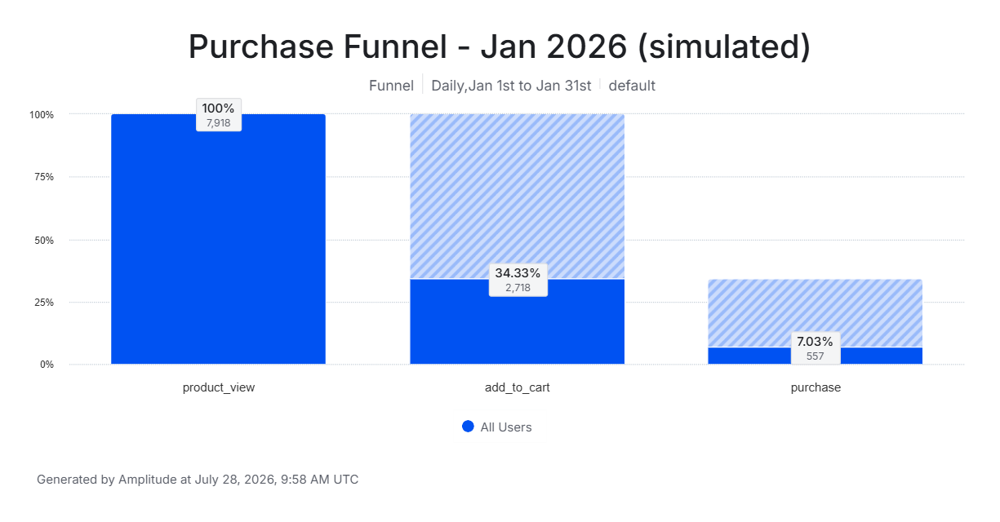
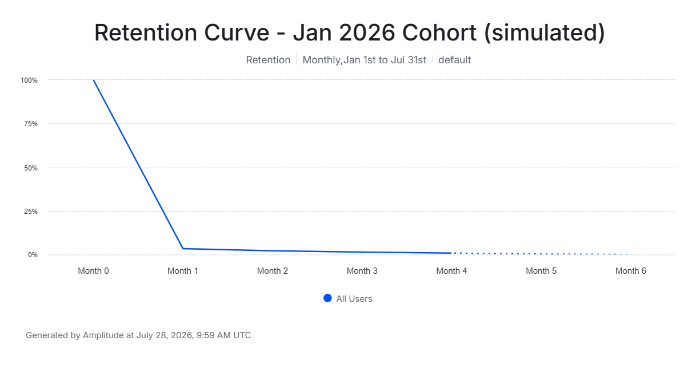

# E-commerce Product Analytics: Funnel, Retention & A/B Testing

An end-to-end product analytics case study using real e-commerce session data 
(Google Merchandise Store, via Google Analytics / BigQuery public dataset). 
Covers funnel analysis, cohort retention, and a simulated A/B test with 
statistical significance testing.

## Tools Used
- **SQL (BigQuery)** — data extraction, funnel construction, cohort retention
- **Amplitude** — funnel and retention visualization, cross-validated against SQL
- ### Amplitude Charts
*Note: dates in these charts show as 2026 rather than 2017. Amplitude's free 
tier only displays data within a recent rolling window, so timestamps were 
shifted forward by exactly 9 years on upload (Jan 2017 → Jan 2026) to make 
them viewable. The underlying event sequence and time gaps between events 
are unchanged — only the calendar labels differ from the SQL analysis above.*

<table>
<tr>
<td></td>
<td></td>
</tr>
</table> 

- **Tableau Public** — executive dashboard
- [**Full memo (Word doc)**](./memo/product_analytics_memo.docx) — findings and recommendations

## Live Deliverables
- 📊 [Tableau Dashboard](https://public.tableau.com/shared/CHDZNM6P3?:display_count=n&:origin=viz_share_link)
- 📄 Memo with full findings — see `/memo` folder

## Key Findings

**Funnel (Jan 2017, 64,694 sessions):**
| Stage | Sessions | % of Total |
|---|---|---|
| Total sessions | 64,694 | 100% |
| Product views | 9,211 | 14.2% |
| Add to cart | 3,386 | 5.2% |
| Purchase | 697 | 1.1% |

- Only 14% of sessions ever view a product — the single largest drop-off point.
- Mobile converts at 0.40% vs. desktop's 1.41% — a 3.5x gap, despite mobile 
  driving 28% of all sessions.
- Referral traffic brings high volume (12,965 sessions) but converts 10x 
  worse than direct traffic (0.13% vs. 1.35%).

**Retention (Jan 2017 cohort, tracked through Jun 2017):**
| Month | Active Users | % Retained |
|---|---|---|
| 0 | 53,041 | 100% |
| 1 | 2,175 | 4.10% |
| 2 | 907 | 1.71% |
| 3 | 572 | 1.08% |

Steep month-1 drop-off suggests most users are one-time buyers rather than 
repeat customers — an opportunity for post-purchase retention campaigns.

**A/B Test — Simplified Mobile Checkout:**
Simulated a checkout friction reduction (n=315/group). Observed lift was 
directionally positive (11.75% → 15.9%) but **not statistically significant** 
(χ² = 2.254, p = 0.133). Recommendation: extend the test rather than ship on 
an inconclusive result.

## Repo Structure

```​
sql/           -- all BigQuery SQL queries, one file per analysis step

memo/          -- full findings memo (Word doc)

screenshots/   -- Amplitude chart exports
​```

## Note on Cross-Tool Validation
Funnel and retention numbers were independently reproduced in both SQL and 
Amplitude. Minor differences between the two (e.g., 9,211 vs. 7,918 product 
views) are expected: BigQuery counts unique **sessions**, while Amplitude's 
funnel counts unique **users** within a 30-day conversion window. Both are 
valid, standard definitions — this distinction is noted explicitly rather 
than treated as an error.
